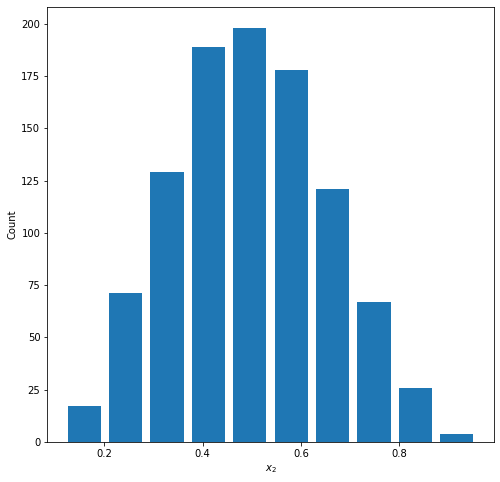
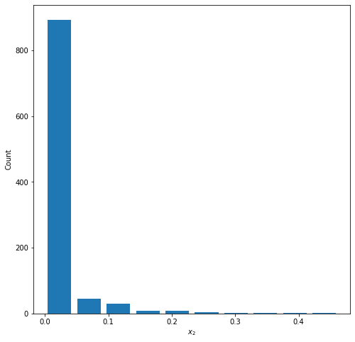
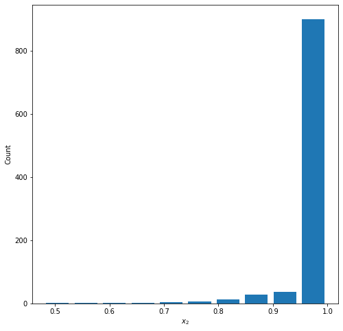
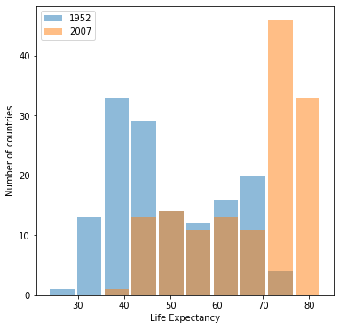
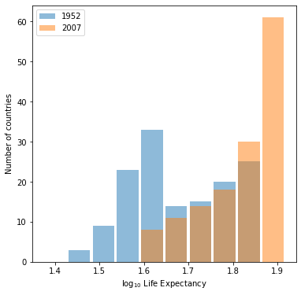
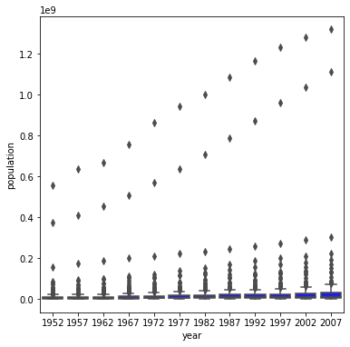
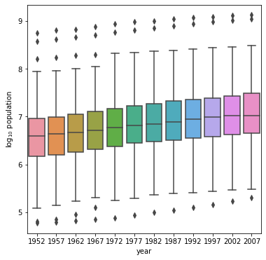

# Project 2

## Types of Data 
### Ordinal Data
Ordinal data is a categorical data type which can be ordered in a specific fashion, or there is some scale that provides ordering. An example for this would be data from a questionaire which asks you to rate something on a scale, such as happiness or satisfaction.

If a restaurant asked you to rate your satisfaction with your meal on a scale from 1 to 5, this would be ordinal data.  
To build a model of this data, an ordinal regression could be used.  We do need to select some features, which might be anything from length of time spent, amount spent, and specific dishes ordered.
The target would then be the rating they provide.
### Continuous Data
Continuous data is a quantitative data type that exists on a continuum.  It has infinite possible values within a given range (the range could also be infinite).  A common example would be temperature.  

An example model could have temperature as a feature and attempts to predict some target.  For instance, if we wanted to predict how long a fire would burn for based on its starting temperature, we would have temperature as a feature (continuous data) and burn time (continuous data) as a target.
### Nominal Data
Nominal data would represent qualitative data which cannot be ordered.  Examples of such data would be country, gender, or color.

## Beta Distribution Graphs
1000 random numbers between 0 and 1.

### Graph 1: Normal
Parameters: a=5.0, b=5.0

Mean = 0.497 \
Median = 0.491

### Graph 2: Right Skewed
Parameters: a=0.1, b=5.0

Mean = 0.0176 \
Median = 0.000120

### Graph 3: Left Skewed
Parameters: a=5.0, b=0.1

Mean = 0.981 \
Median = 0.9999 

## Gapminder Data
### Life Expectancies
#### Graph 1: Life Expectancies in 1952 & 2007

#### Graph 2: Life Expectancies in 1952 & 2007 with Logarithmic Transformation

### Populations
#### Graph 1: Population for all Countries by Year

#### Graph 2: Population for all Countries by Year with Logarithmic Transformation

