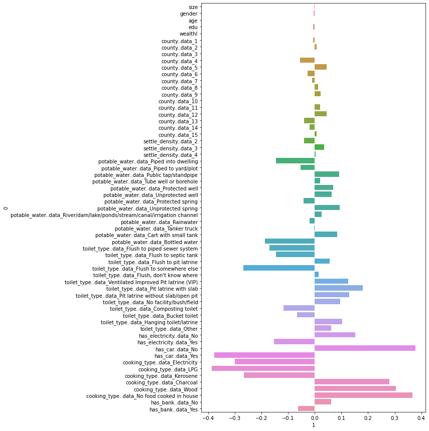
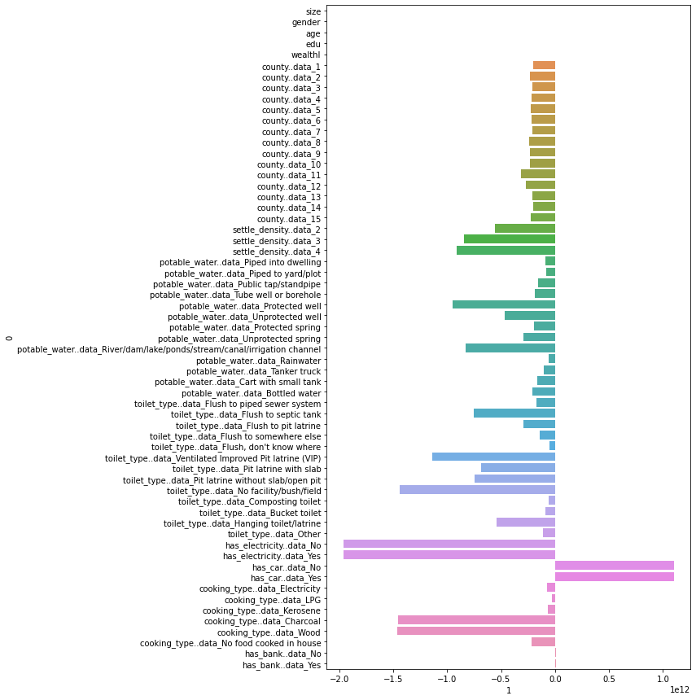

# Project 5

## `wealthC`

After importing the `persons.csv` dataset, we choose `wealthC` to be our
target variable.

### Linear Regression

Let's do a linear regression on this data using KFolds cross validation with 20 folds.  

We then compute the Mean Squared Error (MSE), getting the following result:

```
Training: 0.10890
Testing: 0.10927
```

After standardizing the features:

```
Training: 0.10894
Testing: 0.10928
```

Not much of a change occurs from standardization.

#### Pre-standardization Coefficients:


#### Post-standardization Coefficients:


Looking at these coefficients, the initial coefficients are very small compared to after standardization.  The scale of the x axis on these graphs are much lower, and going in to analyze the coefficients using `numpy` reveals that the range of values for the pre standardization coefficients was [-0.38525, 0.376459].  After standardization, the range becomes [-2028061010880.2666, 2086506911884.3]. 

### Ridge Regression

Running a ridge regression with the found optimal alpha value of `0` yields an MSE of:

```
Training: 0.109
Testing: 0.10936
```

This is pretty much the same as our linear regression.

### Lasso Regression

Running a lasso regression with the found optimal alpha value of `1.356` yields an MSE of:

```
Training: 1.676
Testing: 1.67628
```

## `wealthI`

### Linear Regression

Let's do a linear regression with the new target using KFolds cross validation with 20 folds.  We find that the values of our new target vary greatly, which
can impact how interpretable our MSE is.  To combat this, we can transform our
target using PowerTransformer to get a lower scale MSE value for comparison.  We can also switch to using R2, but in this case we will stick with MSE.

We then compute the Mean Squared Error (MSE), getting the following result:

```
Training: 0.05993
Testing: 0.06050
```

After standardizing the features:

```
Training: 0.05995
Testing: 0.06051
```

Not much of a change occurs from standardization.  Both values are very low, indicating a good fit.

An example of what this may look like without transforming our target would be:
```
Training: 430789787.97701
Testing: 432504413.88336
```
As you can see, the values are extremely large, and can make this value hard to
interpret.

#### Pre-standardization Coefficients:


#### Post-standardization Coefficients:


Looking at these coefficients, the initial coefficients again are much smaller in magnitude in comparison to after standardization.  The scale of the x axis on these graphs are much lower, and going in to analyze the coefficients using `numpy` reveals that the range of values for the pre standardization coefficients was [-0.17368804123491544, 0.670860201859961].  After standardization, the range becomes [-1310634388107.2212, 2163831100226.6729]. 

### Ridge Regression

Running a ridge regression with the found optimal alpha value of `8.102` yields an MSE of:

```
Training: 0.060
Testing: 0.06110
```

This is pretty much the same as our linear regression, equally awful.

### Lasso Regression

Running a lasso regression with the found optimal alpha value of `1.000` yields an MSE of:

```
Training: 1.000
Testing: 1.000
```

This really isn't great compared to the other ones.

## Conclusion

From all these models we looked at, the best model to use for predicting wealth
in this country would be a linear regression.  However, the performance is very
similar to a ridge regression model, so either will be good here.  Based on the various models we used, a linear regression with unstandardized features appears to perform the best.  It has a very low test MSE of 0.06050 when predicting wealthI, which is slightly better than the ridge regression score of 0.0611.  Both these are significantly better than Lasso Regression, which falls behind with an extremely high MSE of 1.000.  For wealthC, linear regression without standardization is the winner once again, with a value of 0.1093.  Again, it's worth noting that the two targets are not directly comparable due to their differing scales.  If a direct comparison neded to be made, it would be beneficial to use R2 instead of MSE.  