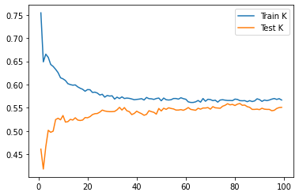
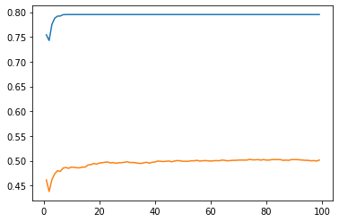

# Project 5, Part 2

In this project, we use the `city_persons.csv` dataset, choosing `wealthC` to be our target.

## K-Nearest Neighbors

First, we'll execute a KNN approach to classify our data.
We do our train test split and scale the data, then we test every value of `k` from 1-100 in order to find the best value of `k` to check.  This value determines how many neighbors to check during fitting.  We get a score of `0.5593` for our best fit, with an optimal `k` of 82.  Below is a plot of training and testing scores, based on different values for `k`.  

Adding a distance weight did not help.  The model performed with similar training accuracy for the best case.  However, the plot is very interesting to look at, since it shows that our model is clearly overfitting.  

## Logistic Regression

Next, we try a logistic regression on this data.  The logistic regression was performed using a train test split of 40% testing.  It performed similarly to the KNN model used previously, with a score of 0.55 for testing.  These two models do not differ greatly in their accuracy, with the KNN being ever so slightly higher.  However, the training score is similar to the testing score, at 0.547, indicating that it is less overfit to the training data.  

## Random Forest

We execute a random forest model on our data, with the number of trees tested being: 100, 500, 1000, and 5000.  Afterwards, we determine the optimal number of samples required to splite an internal node.

### Unscaled Data

With the unscaled data, we find the optimal number of trues is 100, with a test score of `0.5149`.  Using this number, we find the best minimum nubmer of samples required to split an internal node was `27`, yielding a score of `0.559`.

### Scaled Data

We find that the optimal number of trees to use is 1000, with a test score of `0.5007`.  Using this number, we test the minimum number of samples required to split an internal node, and find that `20` was the best for this parameter, yielding a test score of `0.548`.  

## Collapsing Classes 2 and 3

After recoding classes 2 and 3 into one outcome, the models did not show any significant improvement.  For the random forest classifier, accuracy actually dropped quite a bit, from being in the mid `0.5` range to the high `0.4` range.  This may be due to joining the two classes together, causing the boundaries between the two classifications based on the features to be pushed together, but more likely in the scoring metric itself.  By collapsing the classes together, we further create class imbalance, which causes the accuracy metric to be skewed.  We can try using other metrics, or reduce class imbalance in order to mitigate this issue.

## Conclusion

Overall, all the models performed similarly.  However, in both the collapsed and uncollapsed classes case, we find that the KNN approach was the most effective out of all the models we tested.  Each model was between 50-60% accurate, but the KNN model had the highest with an accuracy of 56%.  In the uncollapsed case, this is quite impressive, as there are 4 wealth classes.  With an accuracy of `56%`, we are not achieving a high accuracy, but it is quite a bit better than pure random selection.  In the random case, we'd expect to see accuracies around `25%`.  